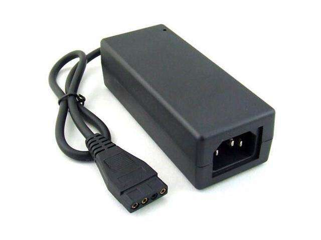

Amstrad CPC6128 / CPC664 power source
=====================================

The goal of this project is to provide a convenient and monitored power delivery to the 8-bit computer [Amstrad CPC6128][1] made in 1985.

It was originally powered from its monitor (color CTM644 or green GT65) by two cables - one from the monitor to the computer - the 5V, and another from the computer to the monitor (probably not to confuse them and plug wrong way) - the 12V, polarized opposite to most 12V DC jacks.

If you want to use this computer now in the 21st century, as I do, and to replace the monitor with something more modern, less blury, and most of all - less blinky, you need to provide a power source.

This project provides... well, not exactly the power adapter itself, but an idea that I had, about how to use a faily easy to obtain and standarized power supply and make your life easier. As a bonus, it will measure the current drawn by both (5V, 12V) circuits and display the values, so that you know how far you are from what your adapter can provide. Also featuring further power connectors for your peripherals.

## Features

To sum up: 
 * 5V and 12V for the CPC
 * Ampere meters for each
 * 12V socket for the CPC, center pin negative
 * 5V cable for the CPC, center pin positive
 * Digital 2x16 display showing the current being drawn (not that I need so many characters...)
 * Output molex connector for anything else
 * Output 5V for a 3.5" disk drive or FDD emulator
 
## Idea

You start with a common 5+12V AC/DC adapter that you would use to power an external hard drive, such as this:

and you want a box that does this:

[IMAGE GOING TO HAPPEN HERE]

[1]: http://www.cpcwiki.eu/index.php/CPC_old_generation
